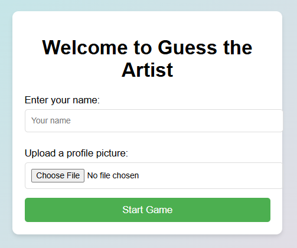
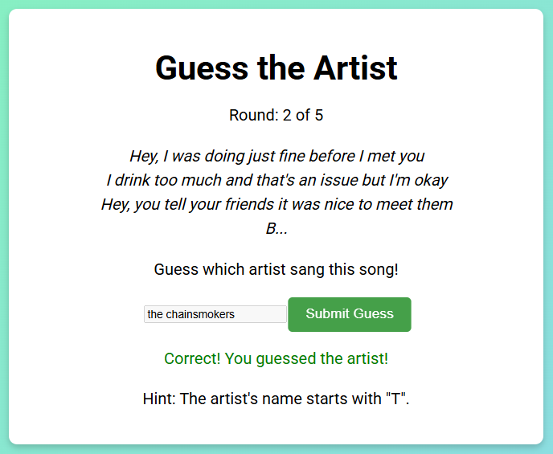
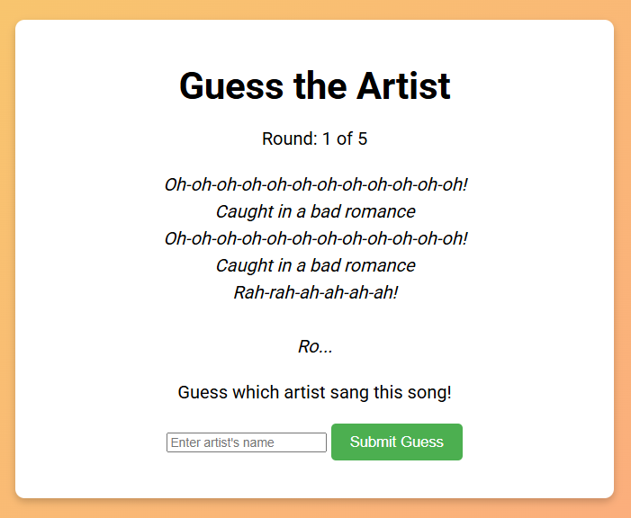

# Guess the Artist 🎵  

## 📊 Overview
Guess the Artist is a fun web-based music trivia game where players guess the artist based on a short lyrics snippet! Users earn points for correct answers and receive a final score summary at the end of the game.

The game combines:
- 🎤 Lyrics and artist recognition
- 🗄️ Database-driven questions
- 🌐 API-powered metadata (pre-loaded into the DB)
- ⚡ Fast-paced round-by-round gameplay

---

## 🧩 Features

- 5-round guessing game with random song lyrics
- Instant feedback after each guess (correct / incorrect)
- Automatic round progression (no “Next Round” button)
- Tracks player performance and displays a final scoreboard
- Uses stored lyrics + metadata from external API sources
- Clean, simple UI for a seamless game experience

---

## 🛠️ Tech Stack

| Layer | Technology |
|-------|------------|
| Frontend | HTML, CSS, PHP-rendered UI |
| Backend | PHP |
| Database | MySQL |
| External Data | Last.fm API (metadata imported to DB) |

---

## 📁 File Structure
```
guess-the-artist-game/
│
├── src/
│   ├── guess_the_artist.php
│   ├── start_game.php
│   ├── game.php
│   ├── game_guesses.php
│   ├── lyrics.php
│   ├── track_list.php
│   ├── full_lyrics.php
│   ├── end_game.php
│   └── update_score.php
│
└── db/
    └── music_game.sql  # DB schema + sample data
```

---

## 🗄️ Database

The MySQL database powers gameplay by storing:
- Artist names
- Song titles
- Lyrics snippets
- (Optional) Playcount + listener data from APIs

You can find the setup SQL here:  
➡️ [`db/music_game.sql`](./db/music_game.sql)

---

## 🎮 Game Screenshots

| Start Screen | Gameplay (Correct Guess) | Gameplay (Incorrect Guess) |
|-------------|--------------------------|----------------------------|
|  |  |  |

| Gameplay — Round Start | Final Score / Leaderboard |
|----------------------|--------------------------|
|  |  |

---

## 🚀 How to Run Locally
### Requirements
- Local web server (e.g., XAMPP, WAMP, MAMP)
- PHP enabled
- MySQL database

---

### Setup Steps
1️. Clone the repository:
```bash
git clone https://github.com/data-by-tolu/Guess-The-Artist-Game.git
```
2️. Import database:

- Create a new database (e.g., music_game)
- Import db/music_game.sql into MySQL

3️. Place project folder in your server root:

- Example: C:/xampp/htdocs/Guess-The-Artist-Game

4️. Run the app:
```bash
http://localhost/Guess-The-Artist-Game/src/guess_the_artist.php
```

Start playing and enjoy! 🎶

---

## 💡 Insights Gained
- Learned how to store and retrieve API data for gameplay
- Gained confidence working with relational database design
- Improved the user experience through timed transitions and score tracking
- Refined front-end formatting for accessibility and clarity
- Integrated external music data into a game format using SQL
- Ensured data consistency by standardizing track metadata

---

## 👩🏽‍💻 Author  
**Toluwani O.** — Data Analyst | Excel, SQL & Tableau  
🌐 Portfolio: [https://tolusdigitalcorner.com](https://tolusdigitalcorner.com)

---
